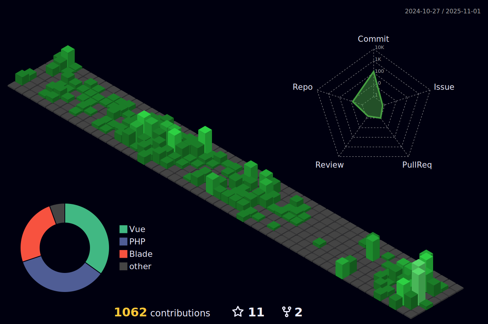

## Sobre

Desenvolvedor Back-End especializado em **PHP e Laravel**, com experiência em construção de APIs robustas e sistemas web escaláveis. Domino o ecossistema full-stack, incluindo JavaScript **(Vue.js, jQuery)** para front-end e bancos de dados relacionais **(MySQL, PostgreSQL, SQL Server)**.

Atuo com **Docker** para conteinerização, **Git** para versionamento e metodologias ágeis **(Scrum)** no ciclo de desenvolvimento. Tenho sólida base em infraestrutura **(Linux, WSL)** e frameworks CSS modernos **(Tailwind CSS, Bootstrap)**.

Em constante busca por desafios que exijam otimização de performance e arquiteturas limpas no ecossistema PHP.

##

  
  

  
 |  |  |  
 | ----------- | ----------- |

 
  

   

  

 
##
   

     
  

  
 
 
